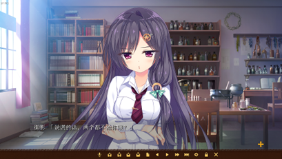

# GalGame讨论中常见的名词

笔者：新堂彩音

`GalGame`是一个相当宽泛的品类，通常我们所说的GalGame是指代`ADV游戏`。即文字冒险类游戏，比如千恋万花。不过，在现在大家的理解中（本群也采用这种理解），GalGame也同样包含了部分二次元相关的`RPG游戏`（角色扮演游戏）以及`SLG游戏`（模拟经营游戏），比如兰斯系列，以及尤格索托斯的庭院等等。

目前市面上大部分的GalGame都是由日本的公司发行，并且最初的版本为日文版，被称为`日Gal`，国内的制造商制造，就被称为`国Gal`。

日gal最初的日文版本被称为`生肉`。由于生肉本身是日文的文本，对于大部分国内的玩家来说并不容易理解，所以有将其翻译成中文的必要。由日文翻译至中文的过程，叫做`汉化`，或者叫做`烤制`。生肉由汉化组，或者官方汉化经手（现在还有AI汉化），被汉化成中文版本后，就成为了`熟肉`。也就是说，熟肉是指代被翻译后，文本变成中文的GalGame游戏资源。

一般来说，我们如果想要游玩一个日本游戏的中文版，需要在其原版游戏的基础上，打上汉化组制作的`汉化补丁`。不过有很多热心的大佬会直接在往上发布已经打上汉化补丁的原版游戏，下载后不经安装过程即可使用，这种游戏版本被称作`汉化硬盘版`，也是我们一般情况下最希望得到的资源。

汉化也分多个种类，包括`机器翻译`，`AI汉化`，`汉化组汉化`，以及`官方汉化`。机器翻译通常指代使用百度翻译等直接对日文文本进行翻译，成本低但是文本通常及其晦涩难懂，现在基本被AI翻译取代。AI翻译指代使用现在的大模型（如ChatGPT，Claude，DeepSeek等）进行翻译，有着很高的质量和很快的翻译效率，新作出来一两天后，很多都会有AI汉化。甚至翻译质量能超越部分质量不高的人工汉化，不过依然会有部分地方有瑕疵。汉化组汉化是最普遍的汉化形式，由爱好者组成的民间团体会对日文游戏进行破解翻译，通常是质量最高也是数量最多的汉化方式，但是一般会花费很长的时间。官方汉化是指代官方的公司，比如Hikarifield，白舟等对游戏进行汉化并且在Steam等平台发行。是正版，但是有时候会被人诟病汉化质量。

根据剧本类型也可以将GalGame分成若干类型。基本可以分成三类：`剧情作（ストーリーゲー）`，`拔作（抜きゲー）`，和`萌作（キャラゲー）`。

剧情作指代以故事为主要的卖点，通常有着波澜起伏的剧情，而不会在日常上花费太多篇幅。拔作指代以R18场景为主要卖点的游戏，通常有着极短的剧情篇幅。萌作指代以女主角的萌点为主要卖点的游戏，通常会在游戏的日常上花费更大笔墨，用于突出女主角的萌点。

对于GalGame的基本构成要素而言，包含游戏的`立绘`，是角色的静态图像，通常用于对话、交互场景，展现角色的形象和表情，如图1所示。以及游戏`CG`，是用于重要剧情或关键场景的精美图像，可能带有动态效果，呈现更为复杂的场景或情节，如图2所示。除此以外，很多游戏会有一个开场动画和开场音乐，也就是俗称的`OP（opening）`，以及一个片尾曲，也就是`ED（ending）`。

游戏立绘

游戏CG

GalGame中，男主和女主们卿卿我我，校园生活，约会等轻松愉快，没有信息量的片段一般被称作`日常`。R18游戏中，会有男主和女主进行性行为的CG，这种CG被称为`HScene`，也被简称为`HS`。

在一些场合，游戏开发商可能希望对游戏的剧情进行补充，或者想依靠游戏本身的IP多赚点钱，就会推出游戏的`Fan Disk`，也被简称为`FD`。基本可以理解为本片游戏的基础上进行的一些延申故事，可以只是发糖的剧情也可以是对角色故事的补充。在某些场合中，开发商会明确推出对于游戏剧情上的一些后续结局，这些通常被称之为`Append`。
