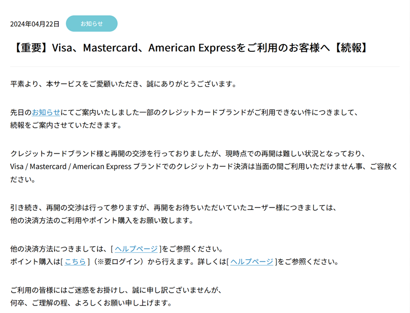
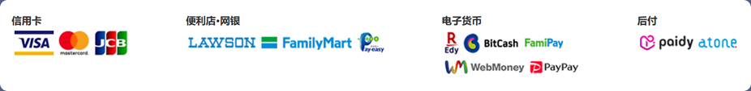
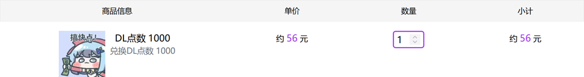
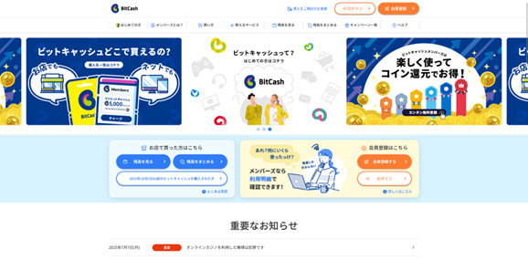
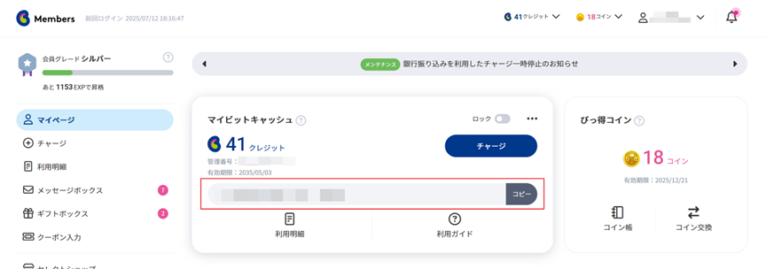
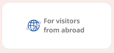
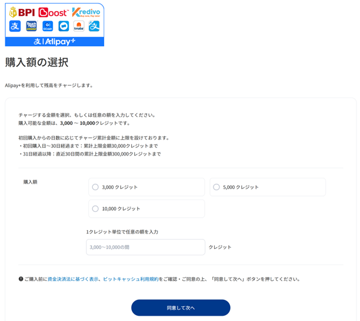
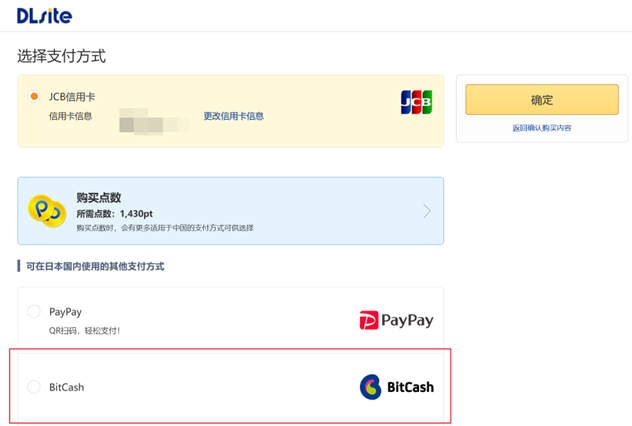

# DLsite生肉的食用方法

笔者：OceanScope

尽管前文提到了大量资源网站，大多数游戏/音声资源都可以在上面找到，但是在游戏刚刚发布、尚无人放流的早期；或者想要寻找还在销售，但是分享链接已经纷纷失效的冷门资源时，入正可能是一个比较好的选择。本文将介绍一个重要的入正平台——DLsite。

## DLsite及相关平台简介
DLsite是Eisys旗下的二次元综合贩卖网站，是目前线上购买二次元向数字商品的最大平台，有大量适合各种年龄段的同人游戏、音声乃至美少女游戏，同时DLsite积极推动平台乃至平台内内容出海，在实现网站界面全翻译的同时，还推行了“大家一起来翻译”项目，借助社区力量翻译平台内内容，是我们购买日本二次元向数字商品（游戏/漫画/音声/etc）的好选择。

Eisys还运营了Ci-en创作者支援平台，功能类似Pixiv Fanbox、Patreon、Fantia等平台，有大量DLsite上的社团和其他同人社团在其上开设了创作者账号。如果上面有你喜欢的社团，不妨关注TA们。在Ci-en上不仅可以了解新作的开发计划和进度，还可以玩到创作者提供的体验版，并提供反馈，来为游戏做出贡献。如果你恰巧财力雄厚，还可以赞助你喜欢的创作者，并查阅赞助者特典。

得益于DLsite的良好本地化，大多数界面都完成了汉化，甚至部分日文商品的简介都有汉化，因此当作普通的购物网站使用即可，这里不再讨论，只关注比较重要且比较麻烦的支付这一环节。

## 支付方式
2024年4月起，DLsite等日本线上平台陆续被Visa、Mastercard乃至American Express以平台内容不符合卡组织价值观为由，停止了收款的能力，用户因此也无法再使用这些卡组织的银行卡付款。现在这些网站可用的银行卡付款方式大多仅剩JCB、大来等小众卡组织。

DLsite提示用户无法继续使用上述卡组织的公告

不过，经过一段时间的努力，DLsite通过使用第三方支付网关的方式恢复了Visa和MasterCard的支付能力，不过仅限日本之外的地区使用。根据笔者的体验，台区的内容和无锁区的日区是比较接近的，因此大家最好使用通过台湾的IP进行访问。

DLsite台区可用的所有支付方式

考虑到新生群友大多刚满18岁，很可能仅有交大借记卡这一张银行卡，因此本文不会仅介绍这一种支付方式，还会介绍方便使用国内常用的支付宝等电子渠道的支付方式。

说到电子支付方式，大多数人想到的应该是DLsite提供的点数系统。DL点数可以1：1地作为日元来使用，对日本国外的顾客来说比较方便。只是由于各种原因，DLsite在国内销售的点数的汇率总是高于人民币对日元的汇率，如图所示。

DLsite当前（2025.7.12）提供的点数汇率（当前汇率下，1000JPY≈48.6CNY）

可以看到，使用官方方式购买点数再充值实在太亏了，相比正常汇率高出了将近15%。在这种点数汇率下，DLsite日常提供的15%OFF优惠券都将被抹平。至于代充，由于资金来源常存在盗刷等问题，本文不做推荐。

因此，下面将介绍在不使用点数进行支付的情况下，在这些网站上可用的支付方式。注意，本节提到的两种支付方式并不限于DLsite，在Fanbox、Fantia等平台亦是通用的，可以根据自己的需求去尝试，避免被代购之类的第三方抽成。以台区为例，DLsite支持的其他支付方式如下图所示。

### BitCash支付

这里首先介绍BitCash，它可以在让用户方便地通过国内电子付款方式充值的同时，做到汇率更接近当前的银行汇率，从而节省一些开销。

BitCash的首页

BitCash注册时只需验证邮箱，手机号验证是不必要的（绑定银行卡时必要且只接受日本手机号），注册登录完毕后，会显示这样的界面。

BitCash的账户页面

其中，红色方框内的十六个平假名就是付款时使用的信息（作用类似银行卡号），请务必保密好。充值点击右侧的チャージ（charge）即可。点击チャージ按钮后，滚动到页面最下方，会有这样的图标。

日本国外可用的充值方式

我们就使用这个方式进行充值。首先点击这个图标，再在下一个页面点击Next，就可以看到充值点数的数额和熟悉的支付宝（Alipay+）图标了。此购买方式使用的是支付宝的汇率，和银行汇率差距不算很大，因此可以省一些钱[^1]。~~但是最低充值3000JPY~~

[^1]: 严格来说是支付宝按照自己的汇率，将日元金额转换为人民币金额，再通过网联清算请求银行从你的银行卡对应账户打款到备付金账户

选择充值数额页面

选择充值数额（3000日元起步，略少于150元人民币），点击同意して次へ，之后使用支付宝扫码即可充值。充值完成后BitCash中的余额会对应增加。接着回到DLsite，付款时选择BitCash，然后继续付款，再输入16位假名就可以完成交易了。

DLsite选择支付方式页面

对于其他网站，也有不少可以使用BitCash的，不过不同网站对BitCash的支持情况不尽相同，如Fantia需要先使用BitCash购买自己的代币TORA COIN，再在网站内支付，按照对应的网站的指南操作即可。
### 银行卡支付

如前所述，DLsite在日本之外的地区恢复了Visa和Mastercard的支付能力。这两个卡组织在国内都有大量借记卡发行，可在这些网站上通过三要素方式支付。

在万事达进入国内、其合资公司万事网联已正式开业的当下，国内银行已陆续推出带有人民币账户、部分还可以自动换汇的万事网联[^2]品牌（银行一般称之新万事达、全新万事达，或有国内外通用等字样）借记卡，对学生来说是比较好用的付款方式。而老万事达（万事达进入国内前的万事达卡）和Visa品牌借记卡仅有外币账户，仍需要自行先使用I类借记卡购买对应货币，再转入要使用的银行卡中。现在比较推荐使用支持人民币入账的新万事达卡，可以免去购汇限制交易时间、且需要等待30秒同意书的麻烦，还不消耗便利化购汇额度。

支付前还请注意，DLsite目前使用第三方代收的方式收取来自Visa和Mastercard两个卡组织的付款时，使用的货币为美元（也就多了一次货币转换的费用），因此若你持有的是老万事达卡或者Visa卡，只需进行美元购汇；若是支持自动换汇的卡则无需购汇。此外，大多数银行卡进行外币支付时，会预授权冻结多于实际付款金额2%~5%不等的卡内资金，入账之后（通常需要2~3天）再退回，若不足会支付失败，因此请保证卡内存款略多于付款金额。支付时，在购买页面输入卡片信息（卡号、有效期和CVV），再通过3DS验证（通常是短信验证码），即可完成购买。

笔者之前使用过中国邮政储蓄银行万事达借记卡和招商银行万事达借记卡，均支持人民币入账；但是体验上差别相当大，可以说一个天上一个地下，具体请看下面的记录。

中国邮政储蓄银行的万事达借记卡可在手机银行或邮储的微信公众号上申请，通过EMS寄送到手后前往线下网点激活即可。这点比较好评，但是银行卡得支付得出去才行，很遗憾，这张卡在这一点做得并不好：产品推出初期时无法网付；能够线上支付后又长期不支持3DS，导致频繁拒付；支持3DS后还闹过不验证CVV的笑话；笔者本人在DLsite上付款时，发现支付时需要反复进行三次3DS认证才能成功付款；甚至时隔一个月后，银行还因为我的这些付款操作给我打电话提醒我账户风险。体验下来就两个字：幽默。

相比之下，招商银行的万事达借记卡虽然发卡晚，但是体验是当之无愧的天花板：人民币入账走卡组织的汇率，比较优惠；预授权冻结的比例为100%；3DS流畅无拒付；甚至有0.5%的返现。不足之处是需要线下申请，不过只需要身份证，也没有乱七八糟的限制，只是笔者在办理过程中可能签了近十次签名；另外，本卡推出初期只有金葵花卡等级，必须开I类账户，而且如果找不到减免的手段，在管理费优惠期结束后（2026年1月1日起）会开始收取150/月的管理费。不过现在这张卡的普卡版本已经推出，可以开II类账户，也不会有管理费的担忧，甚至还保留了返现，说是目前国内最优秀的万事达借记卡也不为过。

建议各位读者结合上述情况进行选择，同时参考这篇[可能是全网最全的国内国际借记卡分析](https://faint-store-ef0.notion.site/231bd9fa7ac18093b18ccbc035740193)，这篇文章列举了国内各个银行的新老万事达卡和Visa借记卡，对于广大难以办理信用卡的大学生非常有用。~~你问我现在用什么？你们苦吧，我用中行JCB信用卡去了.jpg~~

[^2]: 万事达和网联清算在国内的合资公司