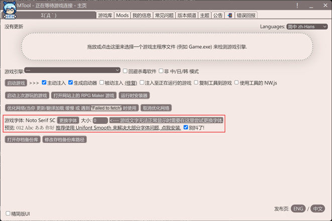
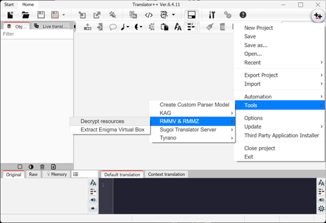

# RPG生肉的食用方法
笔者：OceanScope
## 获取
如前文所述，DLsite是一个入正RPG的好地方。当然，如果你只打算游玩盗版，也是有不少实用的网站可以选择的。但是游玩盗版前需要注意，受限于同人社团的产能和测试能力（很可能只有一两个人），刚刚发售的游戏有错字和各种轻重程度不等的bug乃是家常便饭，因此这些游戏发布后通常会更新几个版本打补丁，游玩前最好去DLsite的发布页或制作社团的Ci-en页面检查一下版本信息，以免因为分享者更新游戏滞后（或者干脆不更新），玩到了有bug的版本。当然，也可以入正一劳永逸。

[Nyaa.si里站](https://sukebei.nyaa.si/)内有大量RPG资源，不过这里的资源一般管生不管养，基本上不会有人更新已经有人发过的游戏。下载公开种子（BT）资源时需要提醒的是，请不要使用迅雷等吸血客户端；此外，为了避免吸血盘和PCDN刷下载浪费我们的上传带宽，可以使用[qBittorrent Enhanced Edition](https://github.com/c0re100/qBittorrent-Enhanced-Edition)，配合[PeerBanHelper](https://github.com/PBH-BTN/PeerBanHelper)进行拦截。使用方法参考[PeerBanHelper的文档](https://docs.pbh-btn.com/docs/intro)即可。

[SouthPlus](https://summer-plus.net)（南+，注意本网站不止一个站点）也是一个综合性的二次元为主的资源分享和交流网站，其中有大量游戏资源，还有不少使用AI翻译后分享出来的资源，如果你想玩的作品比较热门，不妨先去找找看。其资源区分为`免空资源区`和`网赚资源区`两大区，前者是使用免费网盘分享资源的分区，后者则是使用网赚盘分享资源的分区。`免空`指的是免费即可使用的网盘，如百度（虽然下载速度慢，但是**仍能下载**）、OneDrive、MEGA等；`网赚盘`（或相对的，`钱空`）指的是未付费用户在一定周期内低速下载一些资源后，就**完全无法下载**，只有交钱才能继续下载的网盘。网赚盘通常会为资源分享者提供一个优惠码，供分享者分享资源时会提供。如果用户在网赚盘的恶心下，使用该优惠码购买了会员，那么网赚盘就会为对应的分享者提供佣金，所以叫作网赚盘；有些网盘（如夸克）为了吸引分享者，甚至直接按照下载量为分享者提供佣金，也被南+算作了网赚盘。有个别分享者受金钱驱动，有时甚至会去举报使用免费网盘分享的资源，为人不齿。为了良好的资源分享环境，建议尽量使用免费网盘进行资源的分享和下载，不给网赚盘赚钱的机会。
## 翻译
从DLsite上购买的游戏，大多数情况下是日语；一些冷门的游戏即便可以找到资源，也很可能未经翻译，如果你恰好不是日语大手，那么就需要进行翻译后才能游玩。目前LLM发展迅速，翻译质量已经堪用，不失为不懂日语的玩家的翻译不求人好选择；翻译完毕后，将翻译结果导入回游戏，或使用外挂式的实时翻译即可愉快玩耍。本节主要涉及AI翻译的内容。

LLM是AI翻译的核心，一般分为本地部署的小参数量模型和AI服务商提供的在线API服务。前者主要使用[SakuraLLM](https://github.com/SakuraLLM/SakuraLLM)等小尺寸LLM模型，需要有16GB VRAM的NVIDIA显卡才能获得较好的体验(8G显存可以部署7B参数量的量化模型，但是效果可能差于16G显存可以部署的14B的量化模型)；后者则无需任何特别的硬件，只要能正常访问你想使用的API接口，并有充足的token余额即可，现在常用的有国外的ChatGPT、Claude或国内的[DeepSeek](https://platform.deepseek.com/)。

对于SakuraLLM，需要本地运行启动器才能运行，笔者一般使用[OneClickLLAMA](https://github.com/neavo/OneClickLLAMA)，按照项目主页的要求，下载模型文件并放入要求的文件夹后运行脚本即可。对于在线模型，需要注册账号并购买足够的Token，接着生成API key，才能用在后文中的自动化翻译软件中。

二次元向RPG游戏一般是使用RPG Maker制作的，文件结构比较简单，因此有不少自动化的文本导出工具，如[Translator++](https://www.patreon.com/posts/download-public-103339245)（后称T++）、[MTool](https://mtool.app/?lang=chs)等。文本导出后就可以人工翻译或机器翻译。

开始翻译前，首先要导出游戏的文本文件，可使用T++将游戏的原文本导出为.trans文件，以供后面介绍的软件使用，具体的操作可以参考[nevao提供的教程](https://github.com/neavo/LinguaGacha/wiki/BestPracticeForRPGMaker)。后续翻译完毕的文本的嵌入也将使用T++，同样可以参考前述教程。此外，T++本身也是比较优秀的翻译工具，无论是生肉的翻译，还是机翻结果的校对，都可以在其中进行。

准备好AI服务并导出待翻译的文本文件后，需要自动化的软件来根据文本文件发出翻译请求，并整理翻译响应到新的文本文件中。笔者常用的软件有[AiNiee](https://github.com/NEKOparapa/AiNiee)和[LinguaGacha](https://github.com/neavo/LinguaGacha)，当然，[T++本身也是可以进行机器翻译的](https://github.com/fkiliver/RPGMaker_LLM_Translator/wiki/Translator--%E9%83%A8%E7%BD%B2%E6%B5%81%E7%A8%8B)。前两个软件都在其GitHub页面中提供了详尽的配置教程，按照软件提示和教程填写API接口和翻译配置即可，这里不再赘述。T++的翻译需要比较麻烦的配置过程，建议进阶玩家自行了解。

由于游戏的差异，这种翻译方式翻译出来的效果未必令人满意，.js文件内的文本也无法得到翻译，可以进一步阅读fkiliver编写的[T++工作流程](https://github.com/fkiliver/RPGMaker_LLM_Translator/tree/main/Translator%2B%2B)进行调整，或者直接在T++中进行校对。当然，很多时候需要衡量某一个小作品是否有必要花掉大量精力来精修。

对于Unity引擎的游戏，没有统一的文本提取方法，只能实时翻译或者人工寻找文本逐个翻译替换。目前常用的方式是通过[AutoTranslator](https://github.com/bbepis/XUnity.AutoTranslator/releases)插件修补游戏进行翻译。翻译时插件会实时提取游戏显示的文本，然后发送到对应的翻译器，翻译器再调用翻译API进行翻译，最后再替换掉游戏中显示的内容，所幸翻译好的文本会保留在游戏文件夹中，翻译过一次后就可以直接使用本地已经翻译好的文本，无需再次翻译。AutoTranslator中，使用翻译器需要使用编译好的.dll，可以在[SakuraTranslator](https://github.com/fkiliver/SakuraTranslator)获取并查阅如何使用。承担翻译任务的LLM可由前文提到的SakuraLLM启动器OneClickLLAMA启动，启动器只负责提供接口，是可以在各种翻译软件之间通用的。

请注意，由于RPG游戏上下文难以关联，人物对话、旁白和菜单文字都混杂在一起，还常常有各种固定句式配合控制符出现的情况，翻译的难度是高于ADV游戏的。因此，无论是传统机翻还是AI翻译，在无人工修补的情况下，得到的游戏翻译质量是远不如人工精翻的，在分享时最好声明是机翻汉化。
## 游玩
RPG游戏相较于ADV游戏，通过软件机制进行锁区的情况比较罕见，因此大多数时候可以畅玩，游玩前安装好[RTP](https://www.rpgmakerweb.com/run-time-package)即可。RTP有时被称作“RPG三件套”，指的是RPG Maker VX-Ace，RPG Maker VX和RPG Maker XP，更老的RPG Maker引擎制作的游戏已经非常罕见，通常无需下载。

游玩自行翻译的游戏时，有时会由于游戏使用的字体字库较小，不能显示全部的简体中文字符，产生丢字或者字形不对的现象。这时就需要替换字体，建议使用字体覆盖全的如[Noto系](https://github.com/notofonts/noto-cjk/releases/)字体进行替换。

建议使用[MTool](https://mtool.app/?lang=chs)进行字体替换。打开MTool之后，在主页内即可选择并预览想要替换的字体。接着使用MTool启动游戏，字体一般就会被更改成你设置的字体了。这种替换方式操作起来非常简单。

红框处即为修改字体的相关选项

还有一种替换字体的方法是直接替换游戏的字体文件，适合MTool替换字体不生效，且游戏的字体文件未打包的情况。检查游戏文件夹或游戏文件夹/www下，是否一个名字叫fonts的文件夹，若有，找到里面应用于正文的字体（可以打开字体进行预览），把你想要替换过去的字体的文件名改成这个字体的文件名（拓展名也要一样，不能直接改拓展名！），直接覆盖即可。这种方法比较简单，但是碰到游戏内字体被打包的情况就束手无策了。此外，还可能碰到游戏使用的字体比较特殊的情况（如.woff字体），这时需要进行字体格式的转换，使用[AConvert](https://www.aconvert.com/image/)网站提供的图像转换功能即可转换。
## 拆包
RPG Maker游戏的资源和数据文件一般保存在游戏文件夹的根目录或其中的www文件夹中，我们关注的主要是img和audio文件夹，这里面保存了游戏使用的图像和音频资源。这些资源文件可能是松散的、可直接使用的.png或.ogg文件，也可能是打包好的.rpgmvp或.png_文件，甚至可能加密过。但是加密过的RPG Maker游戏的密钥是明文保存在游戏的数据文件中的，因此非常容易解密。如[Petschkos RPG-Maker MV & MZ-File Decrypter](https://petschko.org/tools/mv_decrypter/index.html)就可以在用户提供的游戏文件（System.json）中获取加密密钥，再解密其他打包好的资源文件。T++也提供了解密工具。

T++提供的解密工具 

一般来说，解密完毕的文件中可以直接“使用”的只有绘制好的CG图片和音乐，立绘由于常常是素体+表情/衣着等差分的组合，通常是分开的图片，不能在游戏外直接使用。
